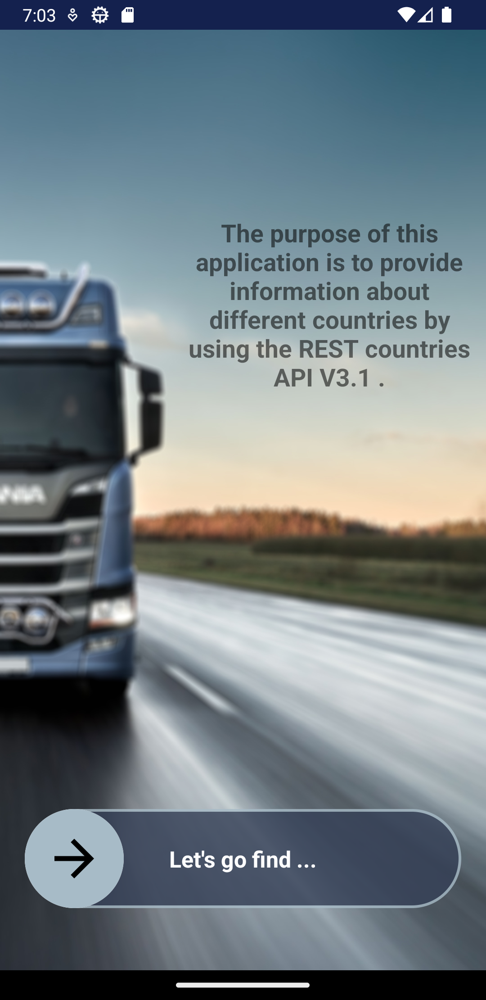
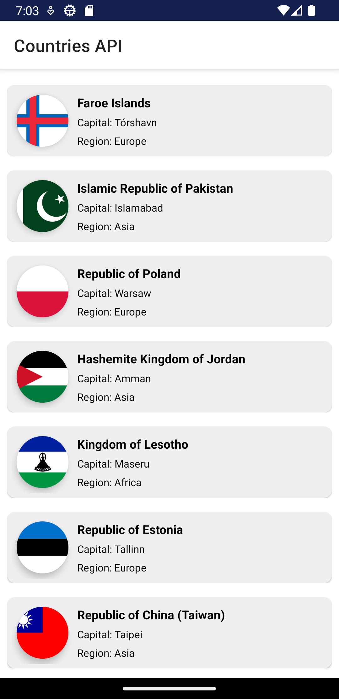
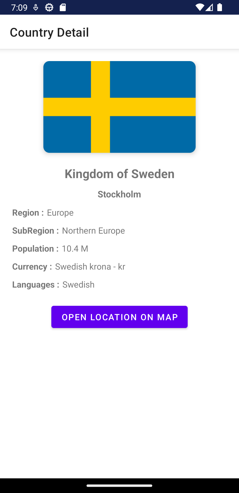

# RestCountriesAPI_MVVM
Overview :

The app was written in Kotlin.

REST COUNTRIES API: Get information about countries via a RESTful API .
 
The API’s Docs: https://restcountries.com/

Technologies and Libraries Used :

- MVVM
- Motion Layout
- Navigation Component
- Data Binding (Two-way DataBinding)
- Retrofit
- Dagger Hilt
- Coil
- Lottie

Screen-Shot :
 

